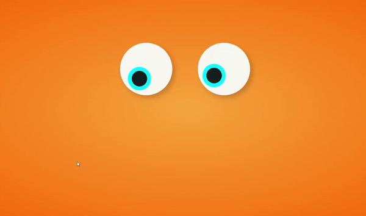
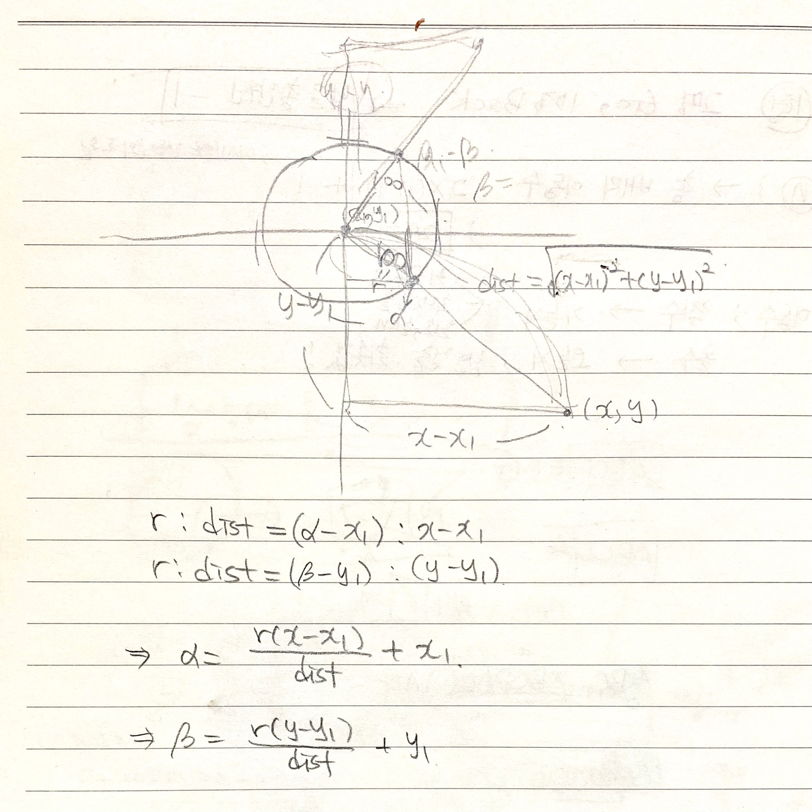

# JS & CSS exercise

## Toggle

[결과 화면 👀](https://parkjisu6239.github.io/2021_JS-CSS-practice/toggle)

- on/off 시 버튼 좌우 이동, 배경 색상 변경

## Rainbow

[결과화면 👀](https://parkjisu6239.github.io/2021_JS-CSS-practice/rainbow)

- 마우스 오버시 무지개색깔로 변경

## IconHoverEffect

[결과화면 👀](https://parkjisu6239.github.io/2021_JS-CSS-practice/IconHoverEffect/index)

- 마우스 오버시 이미지 스케일 업, tilt, 텍스트 표시
- 소스 및 강의 : https://www.youtube.com/watch?v=e-LPHHRRuoM

## Paging

### Example1

[결과화면 👀](https://parkjisu6239.github.io/2021_JS-CSS-practice/paging/scroll)

- 스크롤, 페이지네이션, 네비게이션, 프로그레스바
- 스크롤 이벤트에 따른 이미지, 배경색, 텍스트 변경
- 강의 : 인프런

### Make Buger 🍔

[결과화면 👀](https://parkjisu6239.github.io/2021_JS-CSS-practice/paging/burgerMake)

- 스크롤 or 페이지 네이션으로 햄버거 만들기!
  - 햄버거 재료를 한장한장 쌓아서 햄버거를 만들 수 있습니다
  - 스크롤 이벤트를 감지합니다.

## MouseEffect

[결과화면 👀](https://parkjisu6239.github.io/2021_JS-CSS-practice/MouseEffect/eyes)

- 마우스 커서 이동에 따라 눈동자 움직임
- 마우스가 눈알 안에 있으면 마우스 위치와 눈동자 위치가 같다
- 마우스가 눈앞 밖에 있으면, 위치에 따라 원을 그리며 이동한다.
- 1~4분면에 따라 각각 좌표 구하는 계산이 약간 다르다. 비례식으로 구했다!

## Loading page
[결과화면 👀](https://parkjisu6239.github.io/2021_JS-CSS-practice/Loading/duck-swimming/duck-swimming)

- 헤엄치는 오리!
- wave 이미지 무한 이동으로 물결처럼 보이는 효과, 동시에 움직이는 

## Text to image
[결과화면 👀](https://parkjisu6239.github.io/2021_JS-CSS-practice/blob/master/textToImage/textToImage.html)
